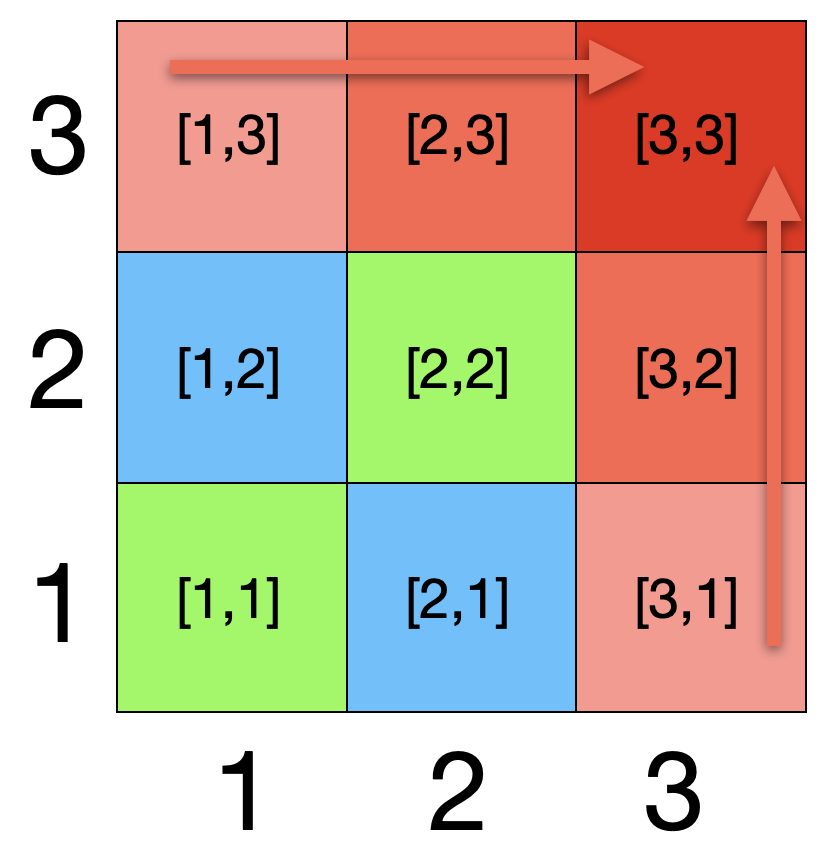

# 
 CMSE 822 &nbsp;&nbsp;&nbsp; SS24
## 
  Project 2 Getting Started with MPI

  &#9786; Team 1  

  Benjamin DalFavero, Reza Khan Mohammadi, Tairan Song, Xiaotian Hua, Ziyu Cheng
  

## Part 1 :  Warm-up

 

## Part 3: MPI Basics
### Q3
Running the command `mpiexec -n 4 ./a.out` after compiling the given `hello.cpp` source file, we got "Hello, World!" printed for four times.  Because we specified numoftasks=4, on four processors, each of them executed the file `a.out` once, as a displaying result, we got "Hello, World!" printed for four times.  

### Q4  
We added the commands `MPI_Init` and `MPI_Finalize`, and put three different statements in the code, the new source file is named as `hello_mpi.cpp`. We recompiled and ran command `mpiexec -n 4 ./a.out`, output results and explanations are as follows.

<u>**Before 'MPI_Init()'**</u>

*Output:*  
<blockquote>
  Before the 'init': Hello, World!  
  Before the 'init': Hello, World!  
  Before the 'init': Hello, World!  
  Before the 'init': Hello, World!
</blockquote>  

*Explaination:*   
  Before executing `MPI_Init`, the four processors are running independently. Therefore, the print code  (`cout`) is executed independently by each processor once.

<u>**Between 'MPI_Init()' and 'MPI_Finalize()'**</u>

*Output:*
<blockquote>
  Between the 'init' and 'finalize': Hello, World!  
  Rank: 2. Size: 4  
  Between the 'init' and 'finalize': Hello, World!  
  Rank: 0. Size: 4  
  Between the 'init' and 'finalize': Hello, World!  
  Rank: 1. Size: 4  
  Between the 'init' and 'finalize': Hello, World!  
  Rank: 3. Size: 4
</blockquote>

*Explaination:*  
  Once we initialize MPI, each processor has its own rank for identification(i.e. task ID). Although each processor executes the print code once again, their operations are no longer independent of each other, instead, they can communicate with each other and cooperate in parallel computation.   

<u>**After 'MPI_Finalize()'**</u>  

*Output:*
<blockquote>
  After the 'finalize': Hello, World!   
  After the 'finalize': Hello, World!   
  After the 'finalize': Hello, World!   
  After the 'finalize': Hello, World!
</blockquote>

*Explaination:*  
  Once we terminate the MPI execution environment using `MPI_Finalize()`, the four processors return to an independent state. Therefore, the print code is executed once again by each processor independently.

### Q5  Complete Exercises 2.3, 2.4, and 2.5 in the Parallel Programing book.  

#### Exercise 2.3.  
*Assume that an addition takes a certain unit time, and that moving a number from one processor to another takes that same unit time. Show that the communication time equals the computation time. Now assume that sending a number from processor p to p ± k takes time k. Show that the execution time of the parallel algorithm now is of the same order as the sequential time.*  
**Answer:**  
Assuming there are n processors tasked with performing n operations. Based on the commmunication structure of parallel vector reduction, these operations will undergo $log_2(n)$ iterations to complete the computation. In each iteration, one unit time is allocated for communication, culminating in a total of $log_2(n)$ unit times. Consequently, both the computation and communication times are quantified as $log_2(n)$.

If we assume sending a number from processor p to p ± k takes time k, the communication time will be doubled in each iteration, i.e. the communication time is $n-1$. The execution time is $n-1+log_2(n)$. For large values of n, this sum closely approximates $n-1$. In comparison, the execution time for sequential computing also stands at $n-1$. Thus, those two algorithms shows the same execution time.

#### Exercise 2.4. 
*Consider the case of summing 8 elements with 4 processors. Show that some of the edges in the graph of figure 2.3 no longer correspond to actual communications. Now consider summing 16 elements with, again, 4 processors. What is the number of communication edges this time?*    
**Answer:**  
In both scenarios described, the number of communication edges remains at 3. The number of communication edges is determined by the number of processors engaged in parrallel computing, not by the total number of elements.

#### Exercise 2.5. 
*Answer the following questions about the double i,j loop:*  
<blockquote>
for i in [1:N]:  
&nbsp&nbsp&nbsp&nbsp x[0,i] = some_function_of(i)  
&nbsp&nbsp&nbsp&nbsp&nbsp&nbsp&nbsp&nbsp x[i,0] = some_function_of(i)  
 
for i in [1:N]:  
&nbsp&nbsp&nbsp&nbsp for j in [1:N]:  
&nbsp&nbsp&nbsp&nbsp&nbsp&nbsp&nbsp&nbsp x[i,j] = x[i-1,j]+x[i,j-1]  
</blockquote>

#### 1. Are the iterations of the inner loop independent, that is, could they be executed simultaneously?
No, the iterations of the inner loop are not independent. The value of `x[i,j]` depends on the preceding value `x[i,j-1]`, and `x[i,j-1]` depends on `x[i,j-2]`. This dependency chain prevents these iterations from being executed simultaneously.

#### 2. Are the iterations of the outer loop independent?
No, the iterations of the outer loop are also not independent. The value of `x[i,j]` depends on `x[i-1,j]`, and `x[i-1,j]` depends on `x[i-2,j]`. They cannot be computed simultaneously.

#### 3. If x[1,1] is known, show that x[2,1] and x[1,2] can be computed independently.
Given `x[2,1] = x[1,1] + x[2,0]` and `x[1,2] = x[1,1] + x[0,2]`, knowning the value of `x[1,1]` enables `x[2,1]` and `x[1,2]` to be computed independently. They can be computed simultaneously without waiting for other values.

#### 4. Does this give you an idea for a parallelization strategy?
Yes. By first obtaining all the boundary value, x[i,1] and x[1,j], and initiating the computation from the diagonal elements, the computation task can be divided into two independent parts. This division allows for the utilization of multiple processors to compute simultaneously following the progression of diagonal value computation.

   

## Part 4: Eat Some Pi